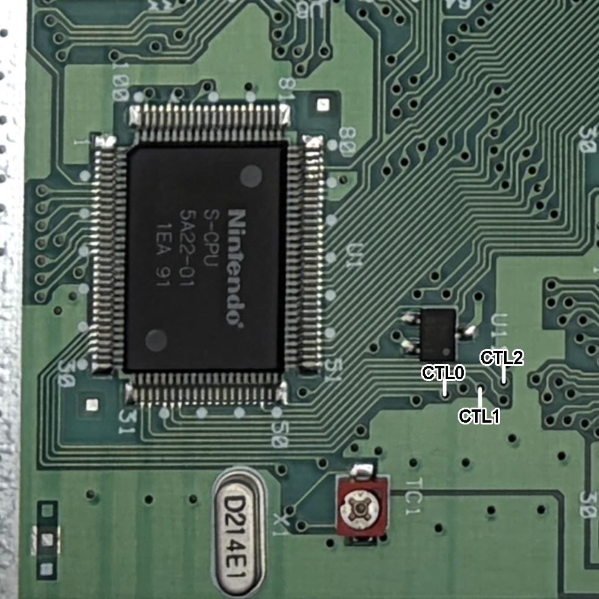
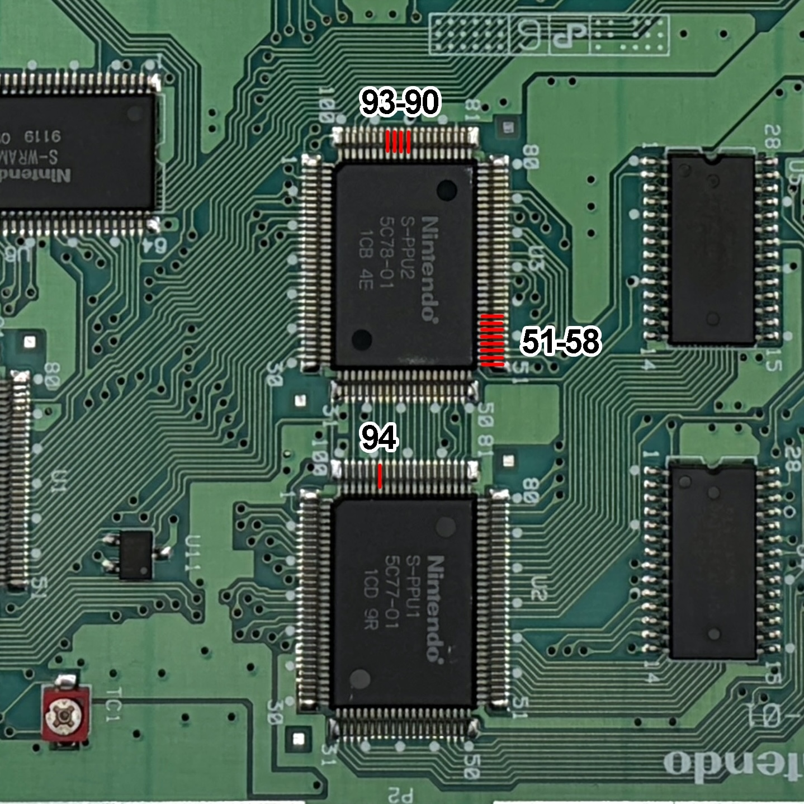
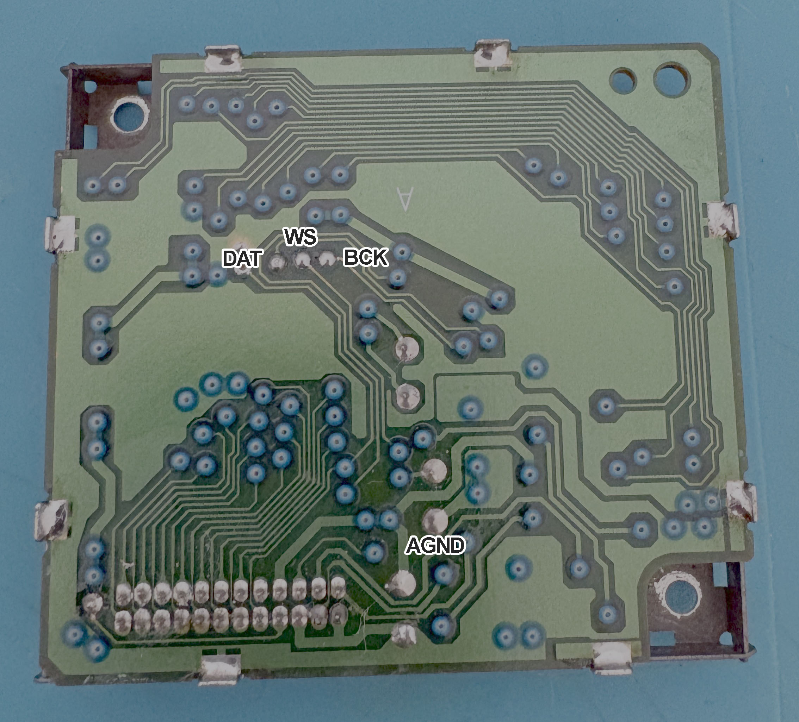

# DigiRetro HD Installation: SNES

## Before You Begin

This guide shows solder points on a console with separate PPU1 and PPU2 chips and a separate audio module. Do not assume these locations apply to other motherboard layouts.

> **Hardware details pending confirmation:** The supported console motherboard and DigiRetro main board/FPC revisions, the final connection for PPU1 pin 94, and the required FFC cable type and contact orientation at both connectors are not yet documented. Confirm these details for your hardware before starting the installation.

- Disconnect the console's power supply and all external cables before working on it. Keep power disconnected throughout soldering and cable installation.
- Use magnification, flux, a temperature-controlled soldering iron, solder wick, and a multimeter. This installation requires fine-pitch soldering and lifting IC pins; forcing a pin can damage it or its motherboard pad.
- In this guide, **FPC** means the flexible circuit soldered to the console, and **FFC** means the flat cable connecting it to the DigiRetro main board.

## Preparation

- Apply flux and reflow the PPU2 solder joints with fresh solder, making sure there are no bridges between adjacent pins.
- Lightly pre-tin the solder pads on both sides of the FPC. Use only enough heat to wet the pads, and avoid prolonged heating of the flex.
- Carefully remove the coating from the three vias marked CTL0, CTL1, and CTL2 next to the S-CPU in the image below. Avoid damaging the copper or nearby traces.
- Apply flux and a small amount of solder to each exposed via.

## Lifting the Pins

The pins to lift are marked in the image below:

- **PPU2:** pins 90-93 and 51-58.
- **PPU1:** pin 94. Its final connection must be confirmed before lifting it.

Apply flux and remove excess solder as needed. Heat each joint until the solder melts, then gently lift the pin just enough to clear its motherboard pad. For PPU2, leave enough clearance to insert the corresponding FPC pad. Do not pry against solid solder or force a pin that does not move freely.

Inspect each lifted pin under magnification for damage, contact with adjacent pins, and residual solder connecting it to its original pad.

## Audio

- Carefully remove the blue coating from the three vias marked DAT, WS, and BCK in the image below, without damaging the copper.
- Apply flux and a small amount of solder to each exposed via.
- Solder one wire to each of these three vias and a fourth wire to the point marked AGND.

## FPC Installation

- Place the FPC over PPU2, sliding the corresponding FPC pads under the lifted pins.
- Check alignment, then tack a few joints to hold the FPC in place.
- Gently lower the lifted pins onto their corresponding FPC pads one at a time. Make sure each pin is aligned **before** soldering it.
- Once alignment is correct, solder all intended FPC joints. Check for bridges and unintended contact with the original motherboard pads.

> **PPU1 pin 94:** Its final connection, including whether it must remain isolated from the original motherboard pad, still needs to be documented. Do not assume it should be soldered back to that pad.

## Wiring

- Connect the CTL0, CTL1, and CTL2 vias on the motherboard to the matching pads on the FPC.
- Connect the DAT, WS, BCK, and AGND wires from the audio module to the matching pads on the FPC.
- Connect the DigiRetro main board's 5V pad to the console voltage regulator's regulated 5 V output, and its GND pad to the regulator's ground connection. Identify these connections for your motherboard revision; do not confuse the regulator input with its output.
- Route and secure the wires so they do not pull on solder joints or get pinched during reassembly. Keep exposed connections clear of metal shielding.

## Connecting the Boards

- With power still disconnected, connect the 32-pin FFC between the FPC and the DigiRetro main board only after confirming the required cable type and contact orientation at **both** connectors. Pin count alone does not establish compatibility.
- Make sure the cable is fully and evenly seated and that any connector latches are secured. Do not force the cable or latches.
- Connect an HDMI cable to the DigiRetro main board.

## Checks Before Powering On

- Inspect all solder joints under magnification for bridges, loose solder, damaged pins, and unintended contact with motherboard pads or shielding.
- With power disconnected, check continuity from each wired source to its intended destination and check that lifted pins are isolated from their original pads wherever the verified connection requires it.
- Check for an unintended short between 5V and GND and between adjacent connections that should be separate. Do not apply power if a measurement is unexplained.
- Confirm that PPU1 pin 94 has its verified final connection and that the FFC orientation is correct at both ends.
- Secure and insulate the main board and wiring so they cannot move or short against the console or shielding.
- Only after these checks pass, reconnect power and test video and audio. Disconnect power again before making any adjustments.
